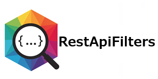
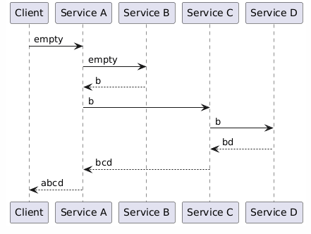

= RestApiFilters - Version 0.0.0-SNAPSHOT
:encoding: utf-8
:lang: de
:toc: left
:toclevels: 5

== What does RestApiFilters offer?

RestApiFilters provides filters to deliver metrics on services and their call behavior in tests or in production.

== Required Infrastructure

=== Java
RestApiFilters requires Java version 11 or higher.

== DurationTraceFilter

The DurationTraceFilter measures the total execution time of a call and, if applicable, the duration of calls initiated by the service itself during the call. It also records the HTTP status of all responses to internal calls.

[NOTE]
====
For internal service calls to be correctly recorded, an incoming header value must be passed to the outgoing internal call in the request. *(Service A -> Service B and Service C -> Service D)*

The response header value returned by the internal call must be passed to the subsequent internal call in the request. *(Service A -> Service C)*

This forwarding continues until no further internal calls are made. In this case, the last received response header value is passed as the response header value in the response of the current service itself. *(Service D -> Service C, Service C -> Service A -> and Service A -> Client)*

====

The invocation data is returned as a JSON structure in a configurable response header. The header name is `x-duration` by default.

.Example `x-duration` JSON structure
====
[source,json]
----
{
  "begin":    "2025-08-28T20:21:15.000000000Z", <1>
  "end":      "2025-08-28T20:21:25.000000000Z", <2>
  "duration": ""PT10S" <3>,
  "trace": [ <4>
    {
      "begin":      "2025-08-28T20:21:15.000000000Z",
      "end":        "2025-08-28T20:21:25.000000000Z",
      "duration":   "PT10S",
      "url":        "https://my-server:8080/my-app/my-endpoint", <5>
      "httpstatus": 200 <6>
    },
    {
      "begin":    "2025-08-28T20:21:17.000000000Z",
      "end":      "2025-08-28T20:21:19.000000000Z",
      "duration": "PT2S",
      "url":      "https://my-server:8080/my-app/my-inner-endpoint",
      "httpstatus": 404
    }
  ],
  "traceRemovalCount": 1 <7>
}
----
<1> The time at which the request was received (according to link: https://de.wikipedia.org/wiki/ISO_8601[ISO_8601]).
<2> The time at which the response was sent (according to link: https://de.wikipedia.org/wiki/ISO_8601[ISO_8601]).
<3> The difference between `end` and `begin` as duration (according to link: https://de.wikipedia.org/wiki/ISO_8601[ISO_8601]).
<4> A list of all executed requests – including any requests triggered internally. The list is sorted by the timestamp of the request's receipt.
<5> The URL of the respective requests.
<6> The HTTP status of the response to an internal request.
<7> An optional indicator indicating how many internal requests were not included in the `trace` list because otherwise the maximum length of the header value would have been exceeded.
====

=== Configurations

The filter can be configured as follows:

==== web.xml

.Example web.xml
====
[source,json]
----
<filter>
  <filter-name>durationtracefilter</filter-name>
  <filter-class>com.github.kreutzr.restapifilters.durationtracefilter.DurationTraceFilter</filter-class>
  <init-param>
    <param-name>durationtracefilter.header-name</param-name>
    <param-value>x-duration</param-value>
  </init-param>
  <init-param>
    <param-name>durationtracefilter.active</param-name>
    <param-value>true</param-value>
  </init-param>
  <init-param>
    <param-name>durationtracefilter.max-length</param-name>
    <param-value>16384</param-value>
  </init-param>
</filter>

<filter-mapping>
  <filter-name>durationtracefilter</filter-name>
  <url-pattern>/*</url-pattern>
</filter-mapping>
----
====

[NOTE]
====
* `durationtracefilter.header-name`: The name of the response header can be changed using this key. The default is "x-duration".
* `durationtracefilter.active`: This configuration parameter enables (`true`) or disables (`false`) the filter. The default is `true`. The filter is disabled if any value other than `true` is specified (case-insensitive).
* `durationtracefilter.max-length`: This configuration parameter allows you to specify the maximum allowable length of the header value. The default is 16384 (= 16 K). If the length of the response value exceeds this value, the last entry in the `trace` list is removed.
====

==== SpringBoot 3

...

